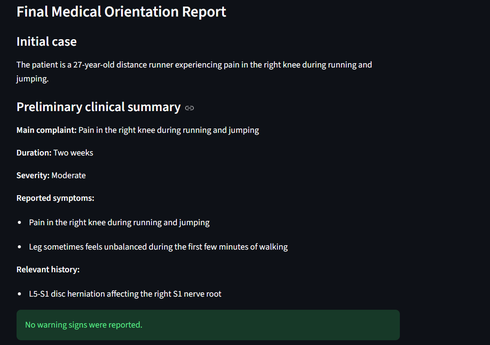
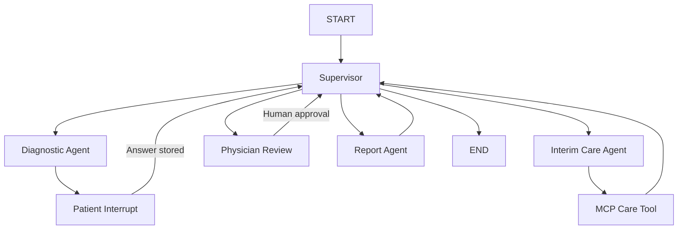
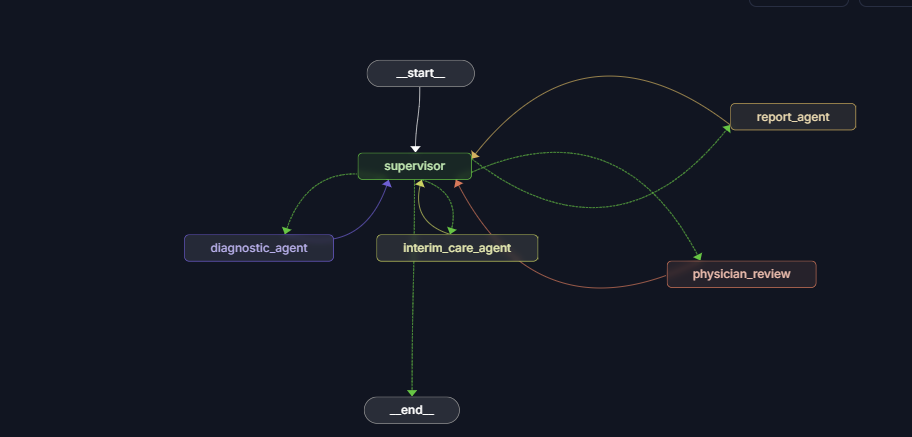
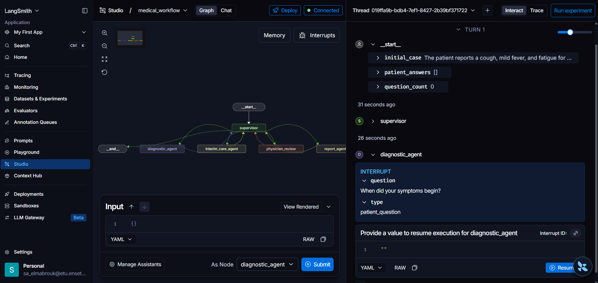
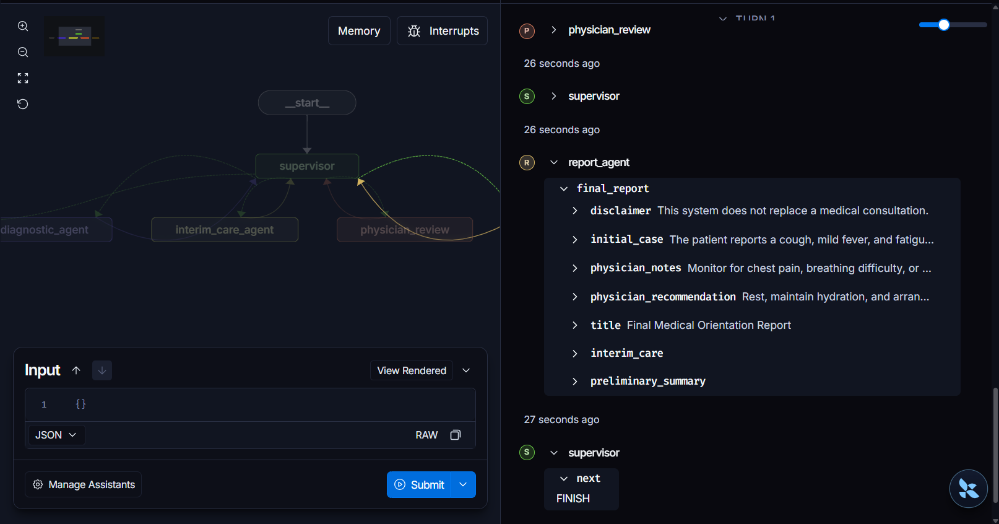

# Medical Multi-Agent System


An academic multi-agent clinical-orientation system built with LangGraph. The application collects patient information through five successive questions, generates a structured preliminary clinical summary, retrieves cautious interim-care guidance through MCP, pauses for physician review, and produces a final structured report.

> This project is an academic exercise. It does not provide a definitive diagnosis and does not replace a medical consultation.



## Features

- Supervisor-controlled LangGraph workflow
- Five successive patient questions using a LangChain tool
- Patient and physician Human-in-the-Loop interruptions
- Checkpointed consultation state using a unique `thread_id`
- Structured LLM output validated with Pydantic
- Real MCP server and client integration
- Warning-sign-aware interim-care guidance
- Physician review before report generation
- Structured final medical-orientation report
- FastAPI REST API with Swagger documentation
- Streamlit user interface
- LangGraph Studio visualization and debugging
- Automated tests covering the required clinical scenarios

## Architecture



The Supervisor examines the shared state after every stage and selects the next node:

1. The Diagnostic Agent asks exactly five questions.
2. The LLM creates a structured preliminary clinical summary.
3. The Interim Care Agent calls the external MCP tool.
4. The workflow pauses for physician review.
5. The Report Agent creates the final structured report.
6. The Supervisor routes the completed workflow to `END`.

## LangGraph Studio

### Workflow graph



### Patient interruption

The graph pauses for each patient question and resumes using the same checkpointed thread.



### Completed workflow

The final state contains the structured report and the Supervisor selects `FINISH`.



## Agents and Components

| Component | Responsibility |
|---|---|
| Supervisor | Examines shared state and selects the next workflow stage |
| Diagnostic Agent | Asks five questions and generates a preliminary structured summary |
| `ask_patient` tool | Pauses execution and collects one patient response |
| Interim Care Agent | Sends severity and warning signs to the MCP tool |
| MCP Care Tool | Returns deterministic routine or urgent interim guidance |
| Physician Review | Pauses the graph for manual treatment and notes |
| Report Agent | Combines all validated state into the final report |

## Technology Stack

| Layer | Technologies |
|---|---|
| Workflow | LangGraph, LangChain |
| LLM | OpenAI through `langchain-openai` |
| Structured data | Pydantic |
| MCP | MCP Python SDK, LangChain MCP Adapters |
| API | FastAPI, Uvicorn |
| Frontend | Streamlit, HTTPX |
| Environment | Python 3.12, uv |
| Testing | Pytest, pytest-asyncio |
| Debugging | LangGraph Studio, LangSmith |

## Project Structure

```text
medical-multi-agent/
├── backend/
│   └── app/
│       ├── nodes/
│       │   ├── diagnostic_agent.py
│       │   ├── interim_care_agent.py
│       │   ├── physician_review.py
│       │   ├── report_agent.py
│       │   └── supervisor.py
│       ├── tools/
│       │   ├── mcp_client.py
│       │   └── patient_tools.py
│       ├── api.py
│       ├── graph.py
│       ├── llm.py
│       ├── schemas.py
│       └── state.py
├── mcp_server/
│   └── server.py
├── frontend/
│   └── streamlit_app.py
├── tests/
│   ├── test_api.py
│   ├── test_mcp.py
│   ├── test_scenarios.py
│   └── test_supervisor.py
├── docs/
│   └── images/
├── langgraph.json
├── main.py
├── pyproject.toml
└── uv.lock
```

## Prerequisites

- Python 3.12
- [uv](https://docs.astral.sh/uv/)
- An OpenAI API key
- A LangSmith API key for LangGraph Studio

Configure the keys as environment variables:

```text
OPENAI_API_KEY
LANGSMITH_API_KEY
```

No `.env` file is required when these variables are configured at the operating-system level.

## Installation

Clone the repository:

```bash
git clone https://github.com/saadBr/medical-multi-agent.git
cd medical-multi-agent
```

Install the locked dependencies:

```bash
uv sync
```

## Running the Application

The backend and frontend run in separate terminals.

### 1. Start FastAPI

```bash
uv run uvicorn backend.app.api:app --reload
```

API documentation:

```text
http://127.0.0.1:8000/docs
```

### 2. Start Streamlit

```bash
uv run streamlit run frontend/streamlit_app.py
```

Frontend:

```text
http://localhost:8501
```

## API Endpoints

| Method | Endpoint | Description |
|---|---|---|
| `GET` | `/health` | Check API availability |
| `POST` | `/sessions/start` | Create a consultation thread |
| `POST` | `/consultation/start` | Start the graph with an initial case |
| `POST` | `/consultation/resume` | Submit a patient answer or physician review |
| `GET` | `/consultation/{thread_id}` | Retrieve consultation state |
| `GET` | `/consultation/{thread_id}/report` | Retrieve the completed final report |

## Running LangGraph Studio

Start the local development server:

```bash
uv run langgraph dev --allow-blocking
```

`--allow-blocking` is required because the MCP stdio adapter performs an internal synchronous executable-access check during local Studio execution.

Create a thread with:

```json
{
  "initial_case": "The patient reports a cough, mild fever, and fatigue for two days.",
  "question_count": 0,
  "patient_answers": []
}
```

Studio will display every transition, interruption, state update, MCP stage, physician review and final report.

## Testing

Run the complete test suite:

```bash
uv run pytest tests -v
```

Current result:

```text
14 passed
```

The suite covers:

- Supervisor routing
- MCP routine guidance
- MCP urgent guidance
- Simple respiratory case
- Case containing warning signs
- Benign case
- FastAPI health and session endpoints
- Consultation initialization and first interruption
- Exactly five questions and five stored answers
- Physician input preservation
- Mandatory report disclaimer

The LLM and MCP results are mocked in complete workflow tests to keep them deterministic and avoid consuming API credits.

## Safety and Ethical Scope

This system:

- Is an academic demonstration
- Produces only preliminary clinical orientation
- Does not provide a definitive diagnosis
- Does not replace professional medical judgment
- Preserves physician-entered treatment and notes
- Escalates reported warning signs to urgent interim guidance
- Includes a medical-consultation disclaimer in every final report


## Author

**Saad EL MABROUK**

- GitHub: [saadBr](https://github.com/saadBr)